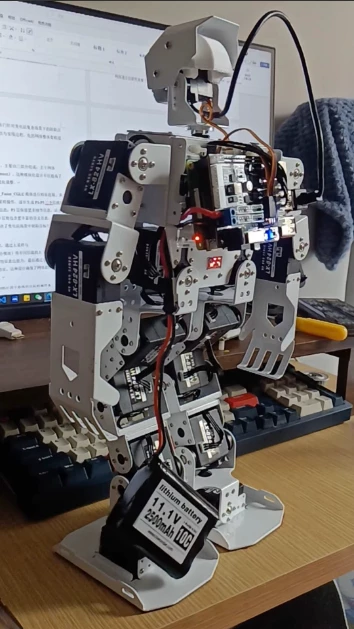

# Humanoid Robot Learning Materials, Including Linux

## Body

Humanoid Robot Compatible Learning Materials, including Linux
Humanoid Robot Compatible Learning Materials, including Linux
Humanoid Robot Compatible Learning Materials, including Linux

Humanoid Robot Compatible Learning Materials, including Linux Basics
Python programming, ROS and other courses are included in the learning materials. These materials are suitable for friends who are learning humanoid robots and related technologies. The materials are provided in electronic form, and the Baidu Pan download link will be automatically sent after purchase. Since it is a virtual product, there is no support for refund after purchase.

## Images

## Payment

Here is a pay link on Stripe ( https://buy.stripe.com/3cs8yP7sY87d0vu9AB ). Please contact me lonlonago@foxmail.com after funding $89, and I will send you a complete data files , thank you!

